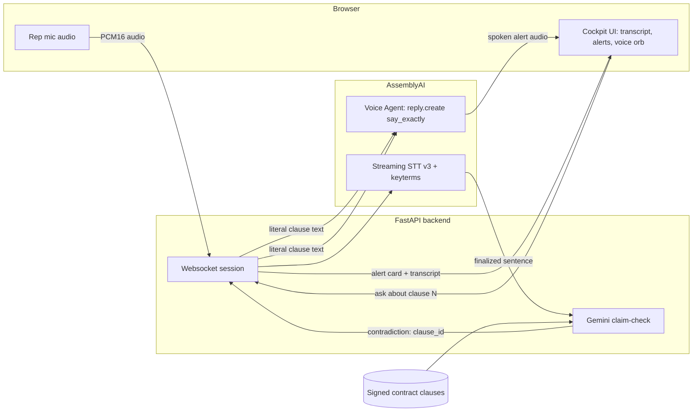
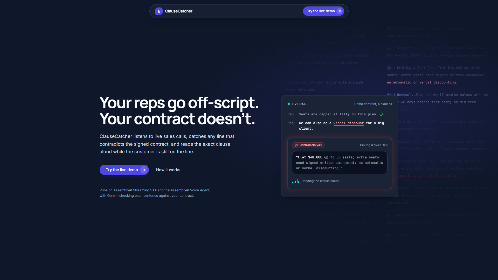
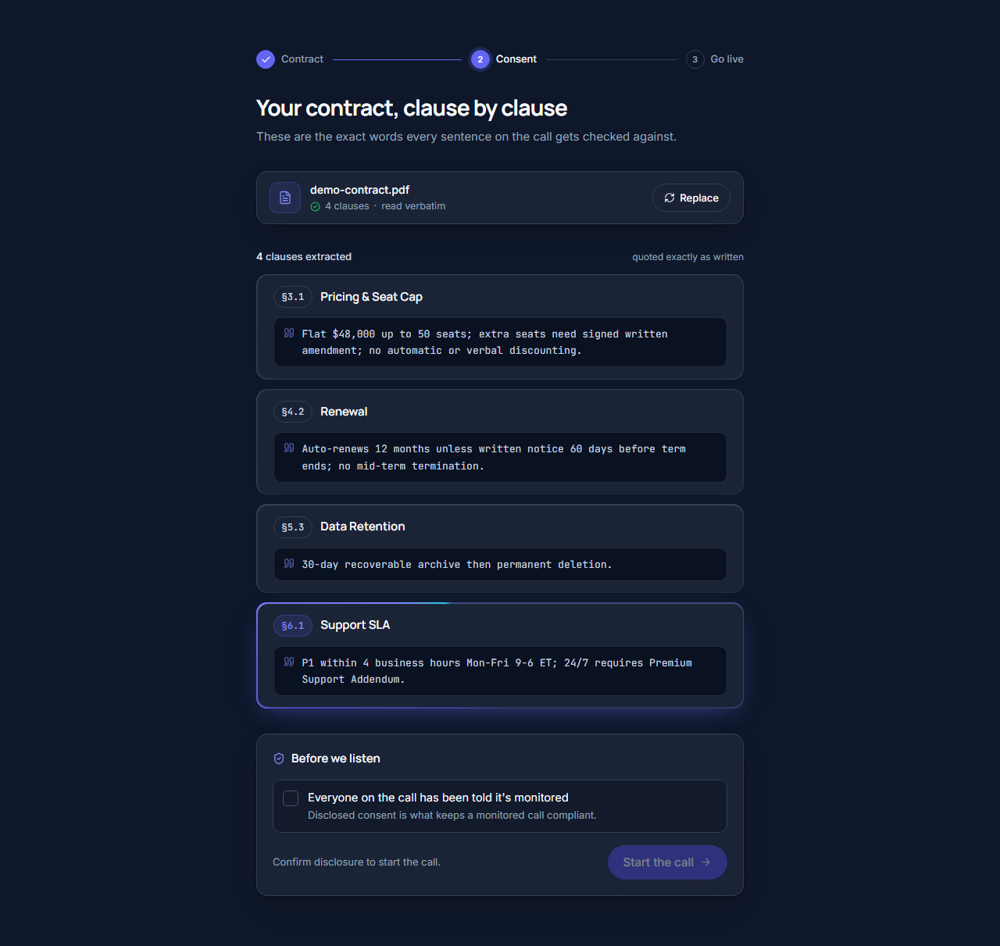
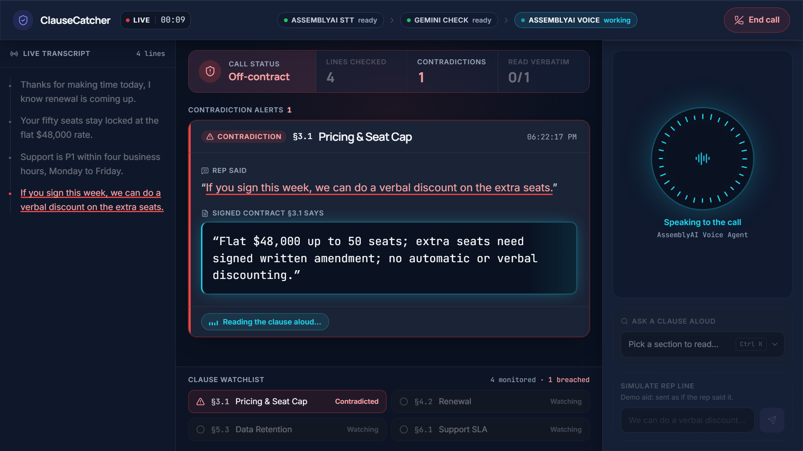
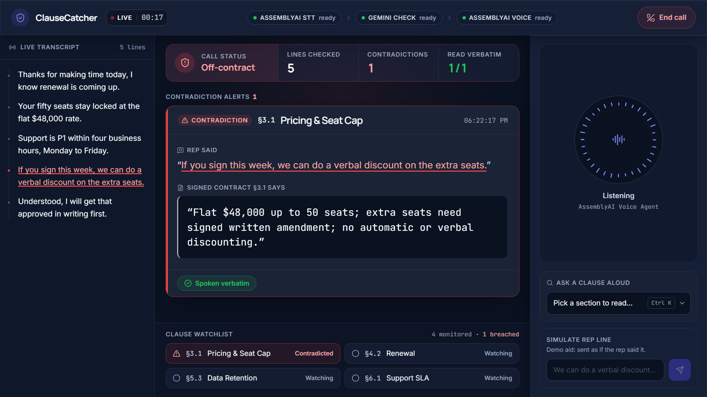

# ClauseCatcher

Live sales-call compliance guardian: it listens to a sales rep, checks what they say against the signed contract, and speaks the exact clause back the moment they contradict it.

Built for the [lablab.ai AssemblyAI Voice Agent Hackathon](https://lablab.ai/ai-hackathons/assemblyai-voice-agent-hackathon) (deadline Sep 30 2026). **Status: live at [https://clausecatcher.onrender.com](https://clausecatcher.onrender.com), demo recorded, runs end to end.**

## The problem

Sales reps go off-script on live calls. They promise a discount the contract doesn't allow, or availability the contract doesn't cover. Nobody catches it in the moment, so the gap between what was said and what was signed only surfaces later, when it's a dispute instead of a correction.

ClauseCatcher listens the whole time and interrupts with the actual contract language, not a paraphrase, the second a rep contradicts it.

## How it works

1. **Listen.** The browser mic streams PCM16 audio over a websocket to the FastAPI backend, which forwards it to AssemblyAI Streaming STT v3 for a live, always-on transcript of the rep. The STT session is seeded with keyterms pulled from the contract's own clauses, which AssemblyAI documents as a recognition-accuracy hint. We wired it up but never measured the gain, so treat it as a mechanism, not a result.
2. **Check.** Every finalized sentence goes to Gemini (`gemini-3.5-flash-lite`, free tier) with the contract's clauses attached, and Gemini returns only a verdict and a clause ID, never generated text. If the check errors or times out, the sentence is marked "unclear" rather than treated as a contradiction. Gemini is never allowed to write the words that get spoken back. Those come straight from the contract.
3. **Alert.** On a contradiction, the server sends an alert card to the browser and opens an AssemblyAI Voice Agent session to speak it, using `reply.create` with an instruction to say the literal clause text exactly, word for word. No model rewrites the alert's wording: Gemini picks the clause, the server supplies the contract's own words, and the Voice Agent is instructed to repeat them verbatim. The spoken audio plays in the ClauseCatcher browser tab (the rep's own headset or speakers). ClauseCatcher doesn't connect to the calling platform and doesn't inject audio into the call.
4. **Answer.** A manager watching the call can pick any clause from the cockpit rail by number (a dropdown, not a spoken question). The server looks the clause up directly and has the Voice Agent speak that answer the same verbatim way. There's no agent tool-calling round trip here, since that path proved unreliable in testing.
5. **Report.** At the end of the call, the session produces a report: every clause referenced, every contradiction caught, and basic call stats.



## Why AssemblyAI

ClauseCatcher uses two separate AssemblyAI connections, on purpose, and that split is the core architecture decision (see `docs/adr/0001-voice-architecture.md`):

- **Streaming STT v3** carries the rep's audio for the entire call. It's pure transcription with no LLM turn-taking behavior to fight, which matters because a companion approach that opened one Voice Agent session for both listening and speaking was tested live and found to talk over the rep on its own, even with a prompt telling it to stay silent. Streaming STT has no such failure mode: it doesn't reply, it transcribes.
- **Voice Agent API** is used only for the part it's actually good at: speaking on command. Alerts and clause answers both go through `reply.create` with an instruction to say the given text exactly and nothing else. That "say exactly" instruction is what makes the verbatim check pass: it was tested against a version that injected the alert as a fake conversation message instead, and that version's replies ignored the injected content entirely. Injecting the alert without a say-exactly instruction never produced a match; adding the instruction did.

Both products are load-bearing. Cut Streaming STT and there's no reliable always-on transcript to check against. Cut the Voice Agent and the alert is a silent card on a screen instead of an interruption a rep actually hears mid-call.

## Safety rules

- **Clause text is always literal.** Every clause the app can speak or display comes from the uploaded contract's own text, extracted once at upload time. Gemini never writes any text we show or speak; it returns a verdict and a clause ID. The Voice Agent is told to read that exact text back word for word, and the server grades its reply against the source afterwards and flags it if it drifts. That is a check after the fact, not prevention: a paraphrase would be flagged, not stopped before it was spoken.
- **Errors resolve to "unclear," never to an accusation.** If the claim-check call fails, times out, or returns something the server can't parse, the sentence is treated as unresolved, not as a contradiction. A false accusation is worse than a missed one.
- **Alerts require evidence.** Nothing fires on tone or vibe. An alert requires a specific clause ID the checker judged contradicted, and each clause fires at most once per 20 seconds so one bad sentence doesn't spam the call.

## Measured results

The raw logs behind every number below are committed under [`docs/evidence/`](docs/evidence/), so you can check them without running anything yourself.

From live end-to-end runs on 2026-09-15 and 2026-09-17 (real AssemblyAI Streaming STT and Voice Agent connections, real Gemini claim-check, scripted rep lines fed through the pipeline):

- A false "10% automatic discount" line raised an alert on contract §3.1; a false "24/7 on Standard" line raised an alert on §6.1. Consistent lines raised no alerts.
- Alerts arrived 4 to 6.5 seconds after the triggering sentence finished. The five logged alerts came in at 4.0 s, 4.3 s, 5.6 s, 6.2 s and 6.49 s. The Gemini claim check is the slow leg; the spoken response is not.
- The Voice Agent's own transcript of its reply matched the contract text exactly (similarity 1.0, flagged `literal_spoken: true`). That is the server's post-speech check against the agent's transcript, not a transcription of the audio that played.
- Alert to first spoken word: 375 ms in the browser run. A separate probe measured the speak request to the first audio frame at 78 to 890 ms across seven steps; 375 ms is the boundary a listener actually experiences, so that is the one we lead with.
- A monitor's clause request for §4.2, picked from the cockpit rail, was read back correctly by voice.
- The call cost about $0.08 to $0.15 by the app's own estimate ($0.0755 for a 55 s call, $0.1535 for a 1:52 call). The estimate prices AssemblyAI at list rate by connection time and doesn't meter Gemini at all, so it is an estimate, not a billed amount.
- 151 server-side tests pass (`pytest server/`).
- Claim-check accuracy, measured 2026-09-18 against the 32 labeled sentences in `spikes/claim_check/labeled_claims.json`, on the `gemini-3.5-flash-lite` free tier: 14 of 14 contradictions caught, each with the right clause ID; 0 false alarms across the 18 sentences that were consistent or genuinely unclear; 0 errors; median 3.5 s per check. Those 32 sentences were written against the same four-clause demo contract, so this measures the checker on its own fixture, not on a contract it has never seen. Confusion matrix and method: [`docs/evidence/README.md`](docs/evidence/README.md).

The browser-microphone path is verified end to end: on 2026-09-17 an automated run drove a real browser (getUserMedia -> AudioWorklet -> 16 kHz PCM16 frames) through the full pipeline and passed all 17 of its live-path checks. The microphone in that run was Chromium's fake audio device playing a WAV file (`--use-fake-device-for-media-stream`), not physical hardware. The browser, the worklet and the frame path are real; the capture device is synthetic, and physical mic hardware is still untested.

Each figure comes from a single run, so treat them as examples, not averages.

The numbers above were measured on local end-to-end runs, not on the hosted instance at https://clausecatcher.onrender.com.

## Screenshots






## Run locally

Backend (FastAPI):

```bash
pip install -r requirements.txt
cp .env.example .env   # fill in ASSEMBLYAI_API_KEY and GEMINI_API_KEY
uvicorn server.main:app --reload
```

Environment variables (see `.env.example`):

| Variable | Required | Purpose |
|---|---|---|
| `ASSEMBLYAI_API_KEY` | Yes | Streaming STT + Voice Agent auth |
| `GEMINI_API_KEY` | Yes | Claim-check calls to Gemini |
| `CLAUSECATCHER_GEMINI_MODEL` | No | Overrides the default (`gemini-3.5-flash-lite`) |
| `PORT` | No | Server port, defaults to 8000 |

Frontend (React/Vite, in `frontend/`):

```bash
cd frontend
npm install
npm run dev        # local dev server with hot reload
npm run build       # produces frontend/dist, which server/main.py serves directly
```

With `frontend/dist` built, the FastAPI server serves the built UI itself at `/`, so a single `uvicorn` process is enough to run the whole app.

## Tests

```bash
pytest server/           # 151 tests, backend logic and API contract
cd frontend && npm test   # frontend unit tests (vitest)
```

## Tech stack

- **Backend:** FastAPI, Python, `google-genai` (Gemini), `pdfplumber` (contract parsing), websockets
- **Frontend:** React, TypeScript, Vite, Tailwind CSS, Motion
- **Voice/transcription:** AssemblyAI Streaming STT v3, AssemblyAI Voice Agent API
- **Claim-check model:** Gemini `gemini-3.5-flash-lite` (free tier)

## License

MIT. See [LICENSE](LICENSE).

## Links

- Demo video: https://vimeo.com/1228498903 (4:21). Source file: `docs/submission/demo.mp4`.
- Live app: https://clausecatcher.onrender.com . Hosted on Render's free tier, so the first request after an idle period takes about 60 seconds to wake. No microphone needed: click Use the demo contract, start the call, and type a line into Simulate rep line -- it runs the identical pipeline.
- Slides: `docs/submission/ClauseCatcher.pdf`. Outline and speaker notes in `docs/submission/SLIDES.md`.
- Evidence for the measured numbers: `docs/evidence/`.
