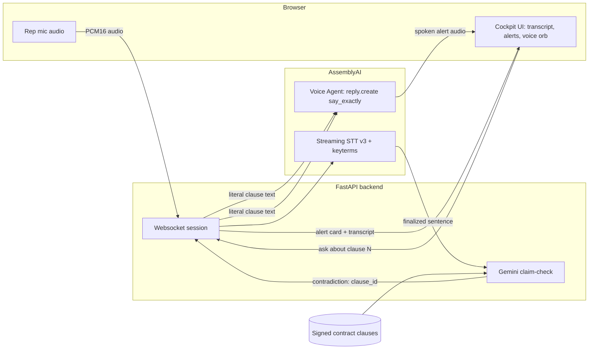

# ClauseCatcher

Live sales-call compliance guardian: it listens to a sales rep, checks what they say against the signed contract, and speaks the exact clause back the moment they contradict it.

Built for the [lablab.ai AssemblyAI Voice Agent Hackathon](https://lablab.ai) (deadline Sep 30 2026). **Status: in development.**

## The problem

Sales reps go off-script on live calls. They promise a discount the contract doesn't allow, or availability the contract doesn't cover. Nobody catches it in the moment, so the gap between what was said and what was signed only surfaces later, when it's a dispute instead of a correction.

ClauseCatcher listens the whole time and interrupts with the actual contract language, not a paraphrase, the second a rep contradicts it.

## How it works

1. **Listen.** The browser mic streams PCM16 audio over a websocket to the FastAPI backend, which forwards it to AssemblyAI Streaming STT v3 for a live, always-on transcript of the rep. The STT session is seeded with keyterms pulled from the contract's own clauses, so section-specific language transcribes more reliably.
2. **Check.** Every finalized sentence goes to Gemini (`gemini-3.5-flash-lite`, free tier) with the contract's clauses attached, and Gemini returns only a verdict and a clause ID, never generated text. If the check errors or times out, the sentence is marked "unclear" rather than treated as a contradiction. Gemini is never allowed to write the words that get spoken back. Those come straight from the contract.
3. **Alert.** On a contradiction, the server sends an alert card to the browser and opens an AssemblyAI Voice Agent session to speak it, using `reply.create` with an instruction to say the literal clause text exactly, word for word. Nothing about the alert's wording passes through the LLM twice.
4. **Answer.** A manager watching the call can ask about any clause by number. The server looks the clause up directly and has the Voice Agent speak that answer the same verbatim way. There's no agent tool-calling round trip here, since that path proved unreliable in testing.
5. **Report.** At the end of the call, the session produces a report: every clause referenced, every contradiction caught, and basic call stats.



## Why AssemblyAI

ClauseCatcher uses two separate AssemblyAI connections, on purpose, and that split is the core architecture decision (see `docs/adr/0001-voice-architecture.md`):

- **Streaming STT v3** carries the rep's audio for the entire call. It's pure transcription with no LLM turn-taking behavior to fight, which matters because a companion approach that opened one Voice Agent session for both listening and speaking was tested live and found to talk over the rep on its own, even with a prompt telling it to stay silent. Streaming STT has no such failure mode: it doesn't reply, it transcribes.
- **Voice Agent API** is used only for the part it's actually good at: speaking on command. Alerts and clause answers both go through `reply.create` with an instruction to say the given text exactly and nothing else. That "say exactly" instruction is the trick that makes the verbatim guarantee real: it was tested against a version that injected the alert as a fake conversation message instead, and that version's replies ignored the injected content entirely. Only the direct instruction produces a spoken match to the source text.

Both products are load-bearing. Cut Streaming STT and there's no reliable always-on transcript to check against. Cut the Voice Agent and the alert is a silent card on a screen instead of an interruption a rep actually hears mid-call.

## Safety rules

- **Clause text is always literal.** Every clause the app can speak or display comes from the uploaded contract's own text, extracted once at upload time. The LLM never generates clause language; it only picks which clause ID applies.
- **Errors resolve to "unclear," never to an accusation.** If the claim-check call fails, times out, or returns something the server can't parse, the sentence is treated as unresolved, not as a contradiction. A false accusation is worse than a missed one.
- **Alerts require evidence.** Nothing fires on tone or vibe. An alert requires a specific clause ID the checker judged contradicted, and each clause fires at most once per 20 seconds so one bad sentence doesn't spam the call.

## Measured results

From a live end-to-end run on 2026-09-15 (real AssemblyAI Streaming STT and Voice Agent connections, real Gemini claim-check, scripted rep lines fed through the pipeline):

- A false "10% automatic discount" line raised an alert on contract §3.1; a false "24/7 on Standard" line raised an alert on §6.1. Consistent lines raised no alerts.
- Alerts arrived roughly 2 seconds after the triggering sentence finished.
- The spoken alert matched the contract text exactly (similarity 1.0, flagged `literal_spoken: true` by the server's own check).
- First voice audio came back about 78 ms after the speak request was sent.
- A monitor's spoken clause question (§4.2) was answered correctly by voice.
- The call used about $0.12 of API usage end to end.
- 81 server-side tests pass (`pytest server/`).

Not yet verified: the browser-microphone live path end to end in a real recording, and a deployed hosted instance. Nothing above is claimed for those.

## Screenshots

- `docs/screenshots/landing.png`: TODO
- `docs/screenshots/setup-contract.png`: TODO
- `docs/screenshots/cockpit-alert.png`: TODO
- `docs/screenshots/report.png`: TODO

## Run locally

Backend (FastAPI):

```bash
pip install -r requirements.txt
cp .env.example .env   # fill in ASSEMBLYAI_API_KEY and GEMINI_API_KEY
uvicorn server.main:app --reload
```

Environment variables (see `.env.example`):

| Variable | Required | Purpose |
|---|---|---|
| `ASSEMBLYAI_API_KEY` | Yes | Streaming STT + Voice Agent auth |
| `GEMINI_API_KEY` | Yes | Claim-check calls to Gemini |
| `CLAUSECATCHER_GEMINI_MODEL` | No | Overrides the default (`gemini-3.5-flash-lite`) |
| `PORT` | No | Server port, defaults to 8000 |

Frontend (React/Vite, in `frontend/`):

```bash
cd frontend
npm install
npm run dev        # local dev server with hot reload
npm run build       # produces frontend/dist, which server/main.py serves directly
```

With `frontend/dist` built, the FastAPI server serves the built UI itself at `/`, so a single `uvicorn` process is enough to run the whole app.

## Tests

```bash
pytest server/           # 81 tests, backend logic and API contract
cd frontend && npm test   # frontend unit tests (vitest)
```

## Tech stack

- **Backend:** FastAPI, Python, `google-genai` (Gemini), `pdfplumber` (contract parsing), websockets
- **Frontend:** React, TypeScript, Vite, Tailwind CSS, Motion
- **Voice/transcription:** AssemblyAI Streaming STT v3, AssemblyAI Voice Agent API
- **Claim-check model:** Gemini `gemini-3.5-flash-lite` (free tier)

## License

No license file is included yet. Treat this repository as all-rights-reserved until one is added.

## Links

- Demo video: TODO (Vimeo)
- Live app: TODO
- Slides: `docs/submission/SLIDES.md`
